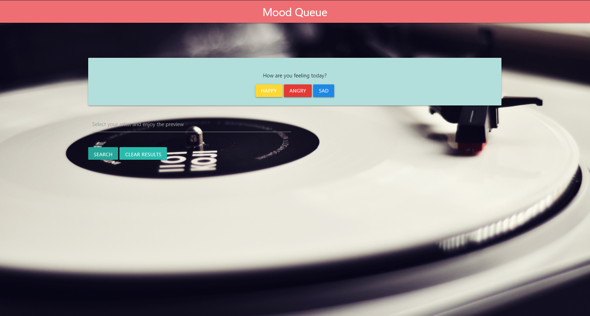
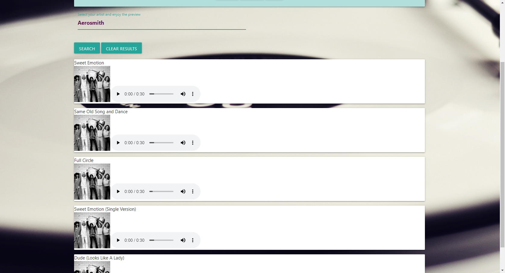

# Mood_Queue

## Table of Contents
- [Introduction](#introduction)
- [Features](#features)
- [Technology Used](#technology-used)
- [Authors](#authors)

## Introduction
This project allows users to create a playlist based on the type of mood they are in. Users can also search for an artist they would like to listen to, then they are given a short list of five songs by the artist.

## Features
- Choose a mood and have a playlist created for the user.

- Search for an artist and have a small list of five songs generated.

- Listen to a preview of the songs that are given.
- Clear search of the last band chosen.

## Technology Used
- HTML
- CSS
- Materialize
- JavaScript
- jQuery
- Deezer API

## Authors
- Katie M.
- Tomas Utreras
- Nicholas Monplaisir
- Jack Ceballos